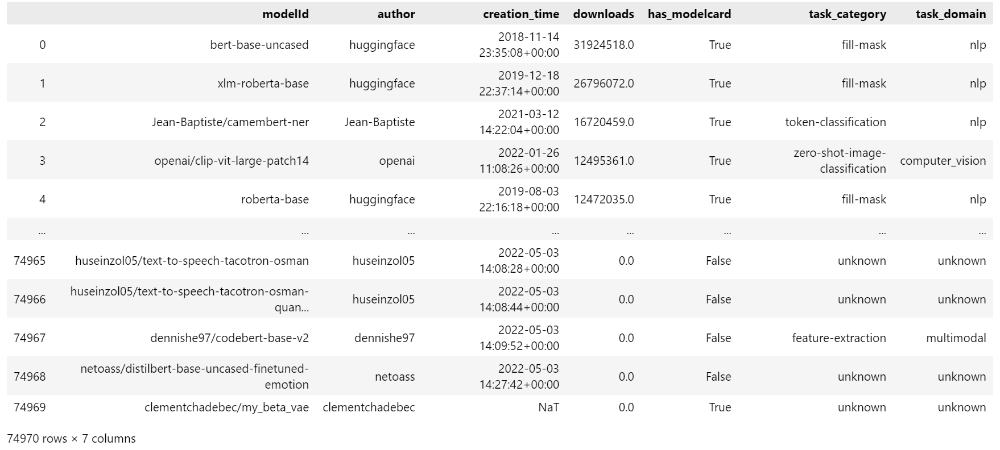
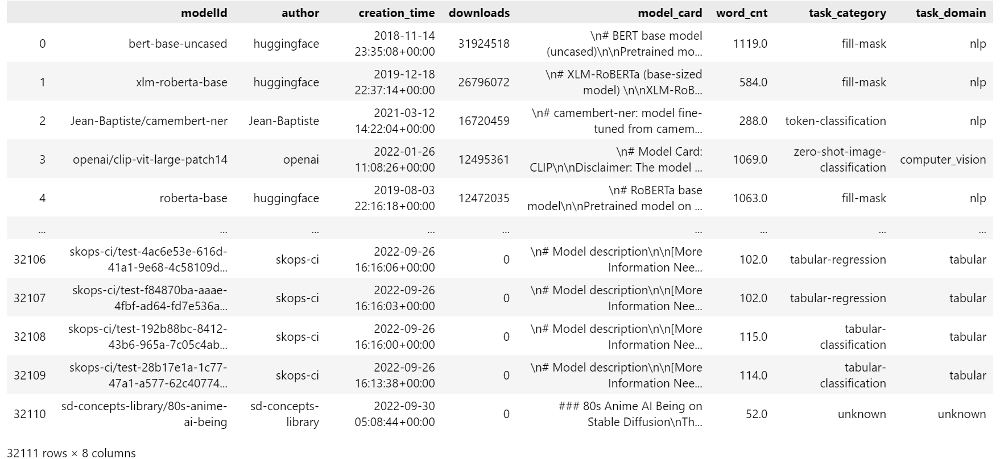

# What's documented in AI? Systematic Analysis of 32K AI Model Cards

## Meta Data of Models and Model Cards
* `model_info.parquet` stores the metadata we extracted of the 74,970  model cards as of Oct 1st, 2023. The metadata include the creation time, author, downloads, whether the model has a non-empty model card, the task category, and the task domain of the models.

* `datasetcard_info.parquet` stores the information we extracted of the 32,111 model cards. The information include the model name, author, creation time, number of downloads, model card content, total word count, task category and task domain.

## Accessing the Models and Model Cards
* `api_example.ipynb` gives basic instructions on how to get access to the models and model cards using Hugging Face Hub API.

## Hugging Face Model Community Overview
* `model_overivew.ipynb` is used to give an overview of the model community on Hugging Face.
## Model Card Intervention Study
The following two files were used to assess the impact of adding model cards on the number of downloads:
* `DiD-normalized-by-first-week.ipynb` reads in the data, normalizes the weekly downloads by the pre-treatment averages, and outputs the formatted `csv` files for statistical analysis. 
* `DiD_get_analysis_results.R` is the `R` script that generates the analysis results, as well as Figure 4(b) in the text.
* The `Model Card Intervention Study` forlder contains the set of 42 model cards created in the *Model Card Intervention Study*.
